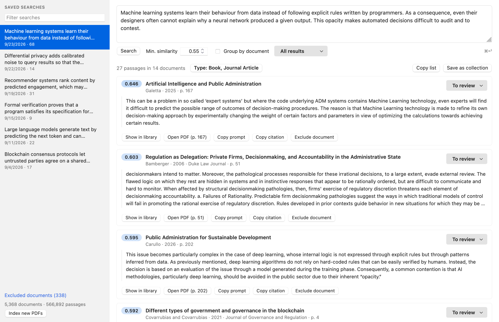
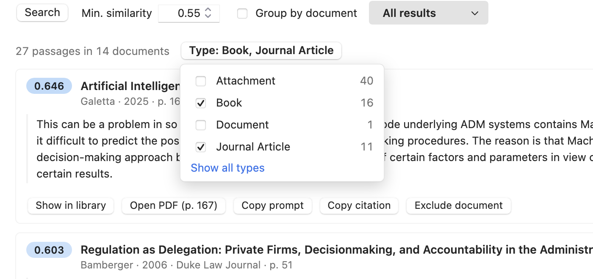
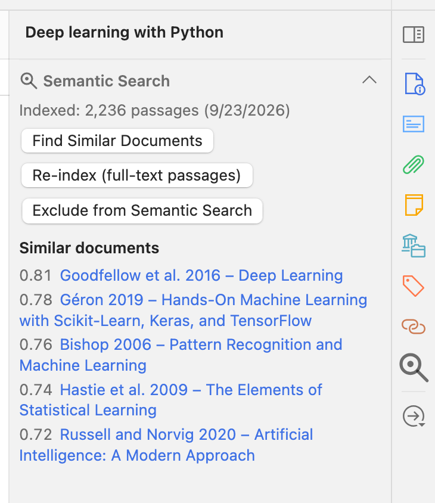

# Zotero Semantic Search

**Find the passages in your PDFs that *mean* what you are looking for — not just the ones that contain your keywords.**

[](https://github.com/ilDon/zotero-semantic-search/releases/latest)


Paste a paragraph from your draft and get back the pages of your library that support it, ranked by how close they are in meaning — in any language, straight inside Zotero. It also works for your AI assistant, through a built-in MCP server.



---

## Why semantic search?

Keyword search only finds the words you type. If your source says *"deep learning models cannot be inspected"* and you search for *"opacity of neural networks"*, it finds nothing.

Semantic search compares **meanings**. Every passage of every PDF in your library is turned into a vector that captures what it says, and your query is compared against all of them. You get relevant passages even when they use different words, or a different language.

## Features

- 🔎 **Search by meaning** across the full text of all your PDFs. Queries can be a phrase, a sentence or a whole paragraph.
- 🌍 **Multilingual**: 74 to 109 languages depending on the model, including across languages (an English query finds Italian, Spanish or German passages).
- 🧠 **Choose your model**: Multilingual E5 small (default), Arctic Embed M v2 for the highest accuracy, or LEALLA-large, the model of the original app. Switching re-indexes in the background while you keep searching.
- ⚡ **Fast**: searching half a million passages takes about 0.15 s.
- 📌 **Wired into Zotero**: every result is linked to its Zotero item. Open the PDF at the right page, jump to the item in your library, copy a formatted citation, or save the results as a collection.
- 🏷️ **Filter by item type and date added**: books, journal articles, theses… in any combination, and only items added to Zotero since a given date. Works on new and saved searches.
- 🗂️ **Saved searches and review workflow**: every search is kept in the sidebar and reopens instantly. Mark each passage as *To review*, *Cited* or *Irrelevant*.
- 🔄 **Always up to date**: new PDFs are indexed automatically in the background.
- 🧭 **Similar documents**: the item pane shows which documents in your library are closest in content to the selected one.
- 👯 **Duplicate PDFs**: identical files are detected (also when you add a new one) and can be merged into one item, keeping metadata, notes, tags, collections and annotations, or moved to the trash.
- 📄 **OCR for scanned PDFs**: PDFs without a text layer can be OCRed with one click (via [ocrmypdf](https://ocrmypdf.readthedocs.io)) and then indexed.
- 🤖 **For AI assistants**: a local MCP server lets Claude Code, Claude Desktop or any MCP client search your library and cite from it, and even give PDFs without metadata a proper parent item.
- 🔒 **Private**: the model runs inside Zotero. Your PDFs and queries never leave your computer.
- ⬆️ **Updates itself** from GitHub releases.

## Getting started

1. **Install**: download the `.xpi` from the [latest release](https://github.com/ilDon/zotero-semantic-search/releases/latest). In Zotero go to *Tools → Plugins*, click the gear icon, choose *Install Plugin From File…* and select the file.
2. **Open** it with the ✨🔍 button next to Zotero's search box, *Tools → Semantic Search…*, or <kbd>⌘</kbd><kbd>⇧</kbd><kbd>E</kbd> (<kbd>Ctrl</kbd><kbd>⇧</kbd><kbd>E</kbd> on Windows/Linux).
3. **Download the model** when asked. This happens once: about 130 MB for the default model, checksum-verified, stored in your Zotero profile.
4. **Let it index.** All your PDFs are indexed in the background; progress appears at the bottom of the sidebar. A journal article takes a few seconds, a long book a minute or two. You can search while it runs, and later PDFs are picked up automatically.
5. **Search.** Type or paste your text and press <kbd>⌘</kbd>/<kbd>Ctrl</kbd>+<kbd>Enter</kbd>.

## Writing good queries

- **Write sentences, not keywords.** The best query is often a sentence or a paragraph from what you are writing: the plugin finds the passages that make, support or discuss the same point.
- **Long paragraphs are fine.** Each sentence is matched on its own. When a result matches one specific part of your text, it says which one (*matches: "…"*).
- **Use any language.** Your query and your sources do not need to be in the same language.
- **Adjust the minimum similarity.** Similarity goes from 0 to 1, but every model has its own scale: the defaults (0.87 for E5, 0.58 for Arctic, 0.60 for LEALLA) suit paragraph-long queries; for a single short sentence, lower them a little (about 0.84, 0.50 and 0.50).

## Choosing the embedding model

The model turns every passage and every query into a vector. Pick it in *Zotero → Settings → Semantic Search*:

| Model | Languages | Accuracy¹ | Indexing speed | Download |
| --- | --- | --- | --- | --- |
| **Multilingual E5 small** (default) | ~100 | 0.87 | fastest | 128 MB |
| **Arctic Embed M v2** | 74 | 0.91 (best, also across languages) | ~3× slower than E5 | 316 MB |
| **LEALLA-large** | 109 | 0.73 | about as fast as E5 | 595 MB |

¹ Mean reciprocal rank when searching a real library of legal and computer-science books and papers (in several languages) for the document an abstract comes from; 1 = always first.

- **E5** is the right choice for most libraries. **Arctic** is the most accurate, especially when your query and your sources are in different languages, if you can wait for a longer first indexing. **LEALLA** is the model of the original app: libraries indexed with it keep working as they are.
- **Switching** downloads the new model and indexes all your PDFs again, in the background. Until that is done, searches keep using the current model; you can also switch right away and search the documents indexed so far. On a large library the first indexing can take many hours (it resumes after a restart).
- **Every model keeps its own index**, so switching back is instant (only PDFs added meanwhile are indexed). Indexes you no longer need can be deleted in the settings.
- Saved searches remember the model they were made with. Open one made with another model and click *Search again with …* to run it with the current model: your *Cited* / *Irrelevant* marks are carried over to the passages on the same pages.
- The models run in int8 inside Zotero (WebAssembly), with no measurable loss of accuracy compared with the original models.

## Working with results

| Action | What it does |
| --- | --- |
| **Open PDF (p. N)** | Opens the PDF in Zotero's reader at the passage's page and searches for the passage |
| **Show in library** | Selects the item in the main Zotero window |
| **Copy citation** | Copies a formatted citation in your Quick Copy style, with the page |
| **Copy prompt** | Copies a ready-made prompt asking an LLM how the passage supports your text |
| **To review / Cited / Irrelevant** | Marks the passage; marks are saved with the search |
| **Type** filter | Keeps only the selected item types; nothing selected = everything |
| **Added** filter | Keeps only items added to Zotero on or after a date (or in the last month, 6 months, year) |
| **Group by document** | Shows one card per document, with all its matching passages |
| **Save as collection** | Creates a Zotero collection with the items in the results |
| **Copy list** | Copies the list of documents, with pages and scores |
| **Exclude document** | Removes a document from the index (you can include it again later) |

<p align="center"></p>

## Inside Zotero

The item pane has a **Semantic Search** section. It shows whether the selected PDF is indexed and which documents in your library are most similar to it, and lets you index, re-index or exclude it. The same actions are in the item context menu, together with *Find Similar Documents* and *Search Passages Like This Abstract*.

<p align="center"></p>

## Use it from your AI assistant (MCP)

The plugin includes a [Model Context Protocol](https://modelcontextprotocol.io) server, so an AI assistant on your computer can search your library, read the passages and cite them properly. Zotero must be running.

**Claude Code**

```bash
claude mcp add --scope user --transport http zotero http://127.0.0.1:23119/semantic-search/mcp
```

**Claude Desktop**: download `zotero-semantic-search-<version>.mcpb` from the [latest release](https://github.com/ilDon/zotero-semantic-search/releases/latest) and double-click it (or drag it into *Settings → Extensions*). This desktop extension runs on your computer and talks to Zotero locally.

> Don't add the URL as a *custom connector* in Claude: custom connectors are reached from Anthropic's servers and require a public `https://` address, so they cannot reach Zotero on your computer (and you should not expose your library to the internet).

**Other MCP clients** can connect directly to `http://127.0.0.1:23119/semantic-search/mcp` (Streamable HTTP transport), or through [mcp-remote](https://www.npmjs.com/package/mcp-remote) if they only support stdio. The snippets are also shown in the plugin's preferences.

Then just ask, for example:

> *"Find sources in my Zotero library that support this paragraph, and give me the citations with page numbers."*
>
> *"Which books in my library discuss the explainability of machine learning models? Quote the most relevant passages."*

| Tool | Description |
| --- | --- |
| `semantic_search` | Passages closest in meaning to a query, with item metadata, item type, page and text. Optional filters: `min_similarity`, `item_types`, `added_after` (items added to Zotero since a date; applied before ranking), `group_by_item` |
| `get_passage` | The text around a result, for more context |
| `get_item` | Full bibliographic data and a formatted citation |
| `find_similar_items` | Documents most similar to a given one |
| `index_status` | Size and state of the index |
| `list_saved_searches` | Your saved searches |
| `list_attachments_without_parent` | PDFs that have no parent item (hence no bibliographic metadata) |
| `create_parent_item` | Creates a parent item with the given type, title, creators and fields for such a PDF (like *Create Parent Item* in Zotero) |

Searches made through MCP do not end up in your search history. The endpoint only accepts local, non-browser connections and can be turned off in the preferences. `create_parent_item` is the only tool that changes your library; it can be disabled separately in the preferences.

> *"Find the PDFs in my library that have no metadata, read their first pages and create proper parent items for them."*

## Duplicate PDFs

Every PDF is fingerprinted (SHA-256 of its content) in the background. When identical files are found, *n duplicate PDFs* appears at the bottom of the sidebar of the search window. For each group you see which copy has a parent item with metadata, notes, annotations and collections, and you can:

- **Merge all**: the most recently modified parent item is kept and receives the fields of the others (on conflicts, the most recently modified wins), their notes, tags, collections and related items; the copies of the PDF are merged into one, keeping all annotations. The other items go to the trash.
- **Move selected to trash**: tick the copies you don't want (a parent item left empty goes too).
- **Keep all**: for files that are meant to be in the library twice.

When you add a PDF that is identical to one already in the library, you are asked whether to delete the new file, keep it anyway or review the duplicates.

## OCR for scanned PDFs

PDFs that have no text layer (typically scans) cannot be searched, so they are listed under **Excluded documents** with the reason *no text*. Click **Run OCR** there, or in the item pane. A terminal window opens and runs [ocrmypdf](https://ocrmypdf.readthedocs.io); when it finishes, the PDF is replaced in place by its OCRed version and indexed automatically.

ocrmypdf must be installed (`brew install ocrmypdf` on macOS; see its docs for Windows and Linux). OCR languages are set in the preferences (tesseract codes, default `ita+eng`).

## Settings

*Zotero → Settings → Semantic Search*

- **Embedding model**, the progress of a model switch, and the indexes on disk
- **Minimum similarity** (per model) and **maximum number of results**
- **Automatically index new PDFs**, and the number of **parallel indexing workers** (more workers index faster but use more memory, ~150 MB each while indexing)
- **OCR languages**
- **MCP server** on/off, with ready-to-copy configuration for Claude Code and other MCP clients
- Model status, and maintenance actions

## Privacy

Everything happens on your computer: text extraction, embeddings, search and the MCP server. The only network requests are:

- the one-time model download (from this project's GitHub releases, or from Hugging Face for LEALLA-large; pinned versions, checksum-verified);
- Zotero's periodic check for plugin updates on GitHub.

## FAQ

**Where is the index stored?**
Next to `zotero.sqlite` in your Zotero data directory: one database per model (`file_embeddings_e5-small.db`, `file_embeddings_arctic-m-v2.db`, `file_embeddings_lealla.db`) and `semantic_search.db` with your saved searches and excluded documents. The models and a small cache live in your Zotero profile. If you sync your data directory (e.g. with Dropbox), the indexes go with it: update the plugin on all your computers.

**Why is one of my PDFs not in the results?**
Look at the item pane or at *Excluded documents*. PDFs without text (scans) can be fixed with *Run OCR*; encrypted PDFs cannot be read.

**What models does it use?**
[multilingual-e5-small](https://huggingface.co/intfloat/multilingual-e5-small) (Microsoft), [snowflake-arctic-embed-m-v2.0](https://huggingface.co/Snowflake/snowflake-arctic-embed-m-v2.0) (Snowflake, used with 256-dimensional vectors) and [LEALLA-large](https://huggingface.co/setu4993/LEALLA-large) (Google). They run inside Zotero via WebAssembly, with no Python, server or GPU needed.

**I used the original Python version of this project. Do I lose my index?**
No. The plugin keeps using your index with LEALLA-large, only indexing PDFs added since: `file_embeddings.db` is renamed `file_embeddings_lealla.db` (its content is unchanged) and your saved searches and excluded documents are copied to `semantic_search.db`. You can then switch to a better model whenever you like.

## For developers

```bash
npm test                        # unit tests (tokenizers and encoders vs. the reference models, chunker, MCP, scan kernels)
node scripts/build.mjs          # build build/zotero-semantic-search-<version>.xpi
node scripts/build.mjs --wasm   # also rebuild the WebAssembly encoders (Rust, wasm32-unknown-unknown)
```

- `addon/` is the plugin: `content/lib/` holds the services (indexing, vector index, search, MCP), `content/ui/` the windows, `locale/` the English and Italian strings.
- `mcpb/` is the Claude Desktop extension: a dependency-free stdio bridge to the plugin's local MCP endpoint.
- `wasm/` is the LEALLA-large forward pass and the int8 vector scan in Rust, compiled to WebAssembly SIMD (frozen: LEALLA results stay bit-for-bit identical).
- `wasm-encoder/` is the int8 encoder of the other models (BERT and GTE architectures, int8 weights per channel and activations per token) and a vector scan of any dimension.
- `tools/` has the scripts used to check LEALLA against the original TensorFlow model, and `quantize_encoder.py`, which builds the int8 weight files (`.ssew`) and tokenizer of the other models and the test oracles.
- Model-dependent tests need `.model/model.safetensors` and `.model/vocab.txt` (or `MODEL_DIR`) for LEALLA, and the output of `tools/quantize_encoder.py` in `.models/` (or `XLMR_DIR`) for the others.
- The int8 weight files are published once in the `models-1` release; new model versions go in a new release (`models-2`, …) referenced by `addon/content/lib/models.js`.
- To run from source, put a file named `semantic-search@ildon.github.io`, containing the absolute path of `addon/`, in your Zotero profile's `extensions/` folder.

**Releasing**: push a tag `vX.Y.Z` on a commit of `master`. The *Release* workflow runs the tests, builds the XPI and the Claude Desktop extension with that version and publishes a GitHub release with both and `updates.json`, from which installed copies update themselves.

```bash
git tag v2.3.0 && git push origin v2.3.0
```
